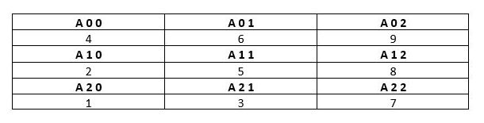
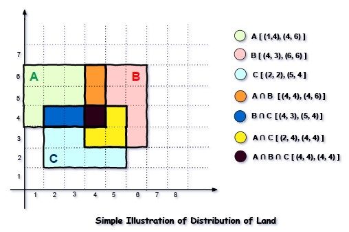

# Objective 1

You are given a two-dimensional 3*3 array starting from A [0][0]. You should add the alternate elements of the array and print its sum. It should print two different numbers the first being sum of A 0 0, A 0 2, A 1 1, A 2 0, A 2 2 and A 0 1, A 1 0, A 1 2, A 2 1.

 

 

Input Format

 

First and only line contains the value of array separated by single space.

 
 

Output Format

 

First line should print sum of A 0 0, A 0 2, A 1 1, A 2 0, A 2 2

Second line should print sum of A 0 1, A 1 0, A 1 2, A 2 1

 

SAMPLE INPUT 

 

1 2 3 4 5 6 7 8 9

 

SAMPLE OUTPUT 

 

25

20

# Objective 2

Microsoft has come to hire interns from your college. N students got shortlisted out of which few were males and a few females. All the students have been assigned talent levels. Smaller the talent level, lesser is your chance to be selected. Microsoft wants to create the result list where it wants the candidates sorted according to their talent levels, but there is a catch. This time Microsoft wants to hire female candidates first and then male candidates.

 

The task is to create a list where first all-female candidates are sorted in a descending order and then male candidates are sorted in a descending order.

 

Input Format

 

The first line contains an integer N denoting the number of students. Next, N lines contain two space-separated integers, ai and bi.

 

The first integer, ai will be either 1(for a male candidate) or 0(for female candidate).

 

The second integer, bi will be the candidate's talent level.

 

Constraints

 

1 <= N <= 105

0 <= ai <= 1

1 <= bi <= 109

 

Output Format

 

Output   space-separated integers, which first contains the talent levels of all female candidates sorted in descending order and then the talent levels of male candidates in descending order.

 

SAMPLE INPUT

 

5

0 3

1 6

0 2

0 7

1 15

 

SAMPLE OUTPUT

 

7 3 2 15 6

# Objective 3

Shyam Lal, a wealthy landlord from the state of Rajasthan, being an old fellow and tired of doing hard work, decided to sell all his farmland and to live rest of his life with that money. No other farmer is rich enough to buy all his land so he decided to partition the land into rectangular plots of different sizes with different cost per unit area. So, he sold these plots to the farmers but made a mistake. Being illiterate, he made partitions that could be overlapping. When the farmers came to know about it, they ran to him for compensation of extra money they paid to him. So, he decided to return all the money to the farmers of that land which was overlapping with other farmer's land to settle down the conflict. All the portion of conflicted land will be taken back by the landlord.

 

To decide the total compensation, he has to calculate the total amount of money to return back to farmers with the same cost they had purchased from him. Suppose, Shyam Lal has a total land area of 1000 x 1000 equal square blocks where each block is equivalent to a unit square area which can be represented on the co-ordinate axis. Now find the total amount of money, he has to return to the farmers. Help Shyam Lal to accomplish this task.

 

Input Format:

 

The first line of the input contains an integer N, denoting the total number of land pieces he had distributed. Next N line contains the 5 space separated integers (X1, Y1), (X2, Y2) to represent a rectangular piece of land, and cost per unit area C.

 

(X1, Y1) and (X2, Y2) are the locations of first and last square block on the diagonal of the rectangular region.

 

Output Format:

 

Print the total amount he has to return to farmers to solve the conflict.

 

Constraints:

 

1 ≤ N ≤ 100

1 ≤ X1 ≤ X2 ≤ 1000

1 ≤ Y1 ≤ Y2 ≤ 1000

1 ≤ C ≤ 1000

 

SAMPLE INPUT

 

3

1 4 4 6 1

4 3 6 6 2

2 2 5 4 3

 

SAMPLE OUTPUT

 

35

 

 

 

Explanation

 

 

For given sample input (see given graph for reference), compensation money for different farmers is as follows:

 

Farmer with land area A:    C1 = 5 * 1 = 5

Farmer with land area B:    C2 = 6 * 2 = 12

Farmer with land area C:    C3 = 6 * 3 = 18

 

Total Compensation Money = C1 + C2 + C3 = 5 + 12 + 18 = 35